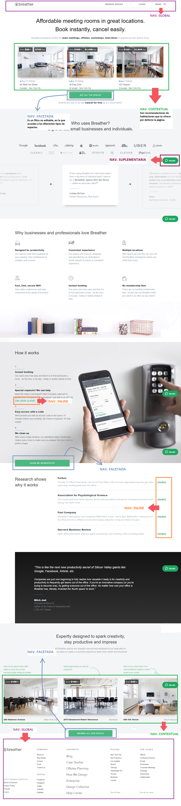
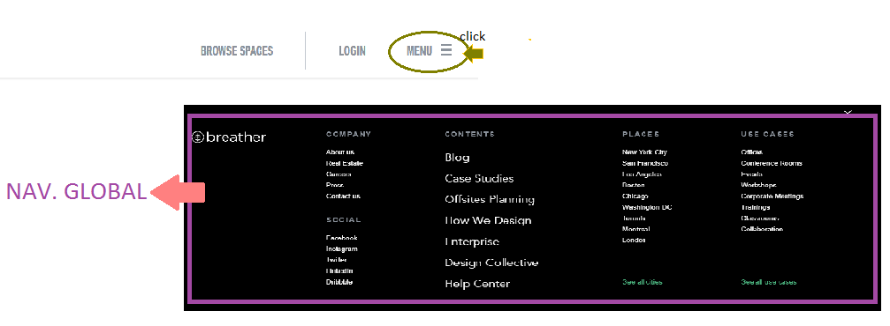
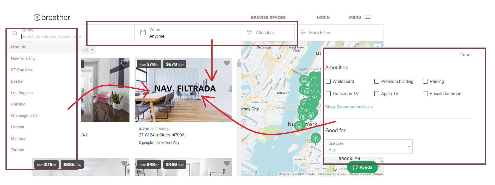
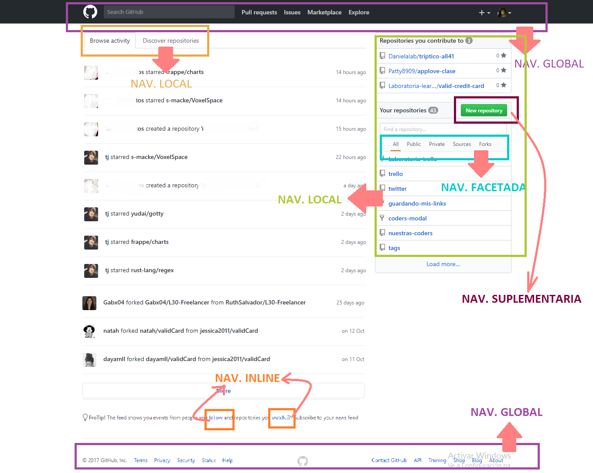
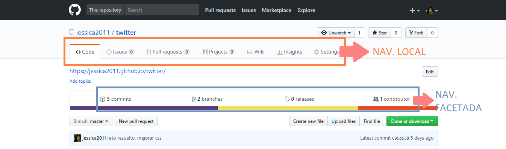
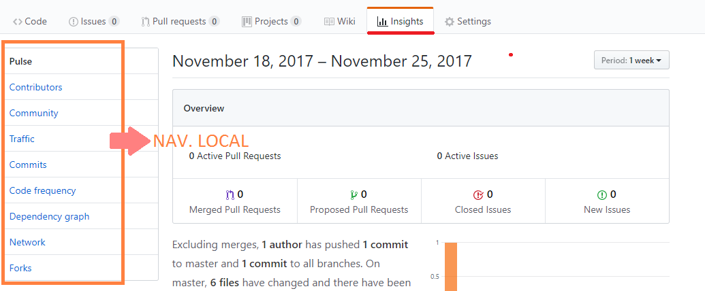
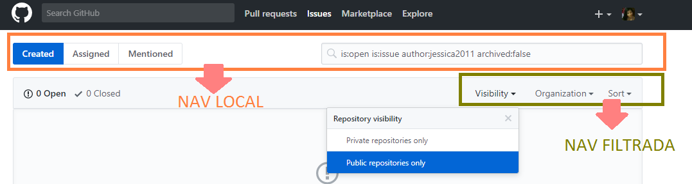
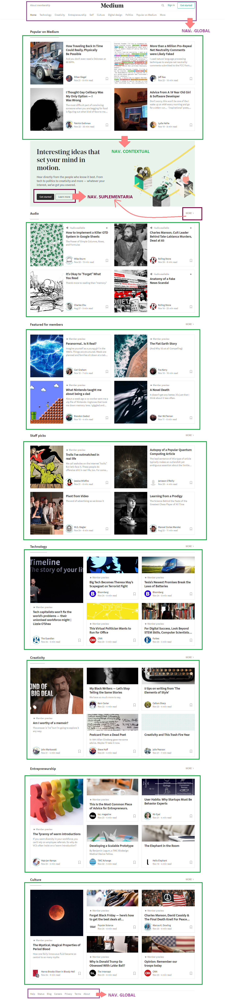
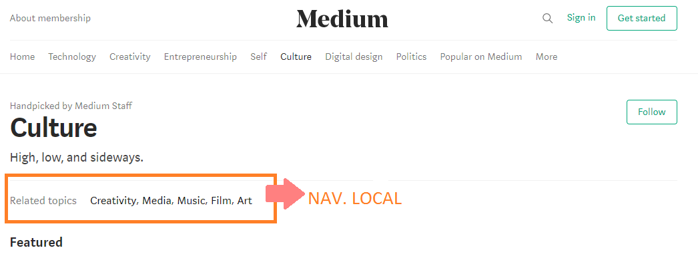
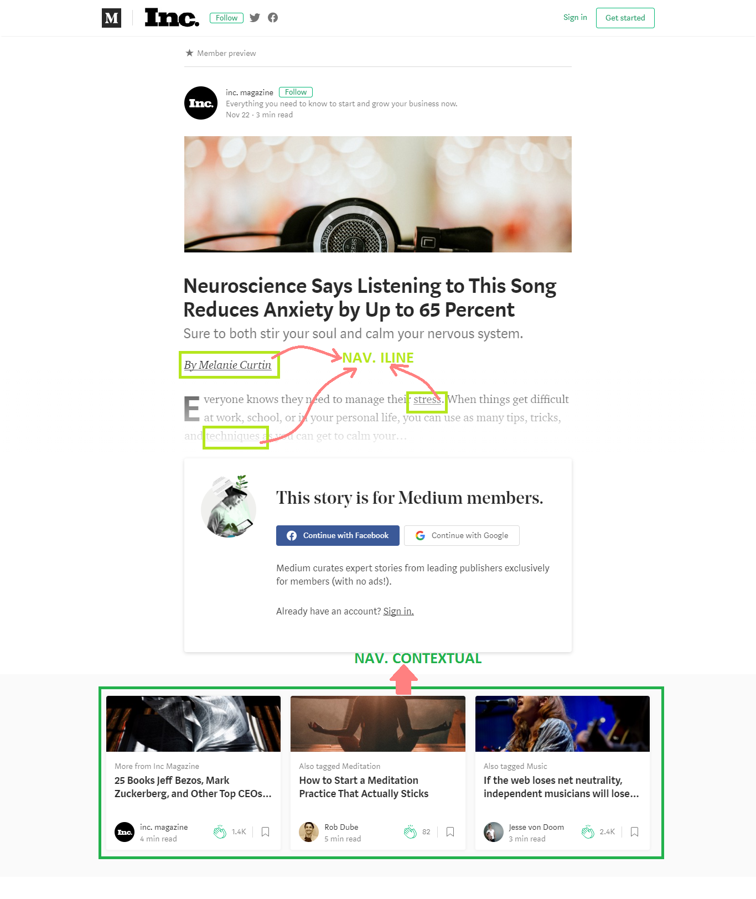

# UX Reto-02
* **Tema:**  _Intro a User Experience Design_

***
## Objetivo:
Reconocer los _elementos de navegaciones_ de los siguientes sites:
1. [**Breather**](https://breather.com/?version=c).
2. [**Github**](https://github.com/).
3. [**Medium**](medium.com).

## Reconociendo las navegaciones: 

### 1. Site _Breather_

A. Elementos de navegación encontrada en la portada principal site _Breather_:

B. Navegando en el site: 

***

### 2. Site _Github_

A. Elementos de navegación encontrada en la portada principal site _Github_:

B. Navegando en el site: 

***
### 3. Site _Medium_

A. Elementos de navegación encontrada en la portada principal site _Medium_:

